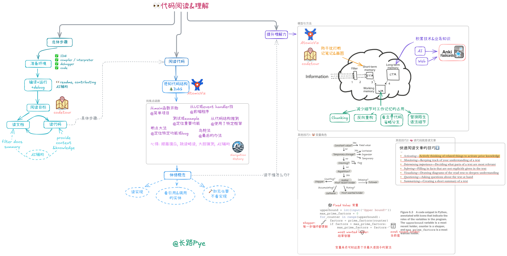

# 解锁代码阅读：从新手到高手的进阶之路

## 代码阅读：不可或缺的编程技能

在程序员的日常工作中，代码阅读占据着极为重要的地位。据统计，超过 50% 的工作时间被程序员用于阅读代码。这一数据直观地表明，代码阅读并非只是编程工作的附属部分，而是核心任务之一。

当程序员接手一个老系统时，面对庞大而复杂的代码库，首要任务便是读懂现有代码。只有理解了系统的架构、模块之间的关系以及代码的逻辑，才能进行新功能的扩展或修复潜在的 bug。在这个过程中，代码是了解系统运行机制的关键。如果不花费时间阅读代码，就如同在黑暗中摸索，根本无法确定新功能的插入点，也难以定位和解决程序中出现的问题。

在研究开源项目时，代码阅读同样不可或缺。开源项目是学习特定知识和技术的宝库，但这些知识和技术都蕴含在代码之中。以一些知名的开源框架为例，通过阅读其代码，程序员可以学习到优秀的设计模式、高效的算法实现以及良好的代码组织方式。在阅读过程中，程序员还能接触到不同开发者的编程风格和思路，从而拓宽自己的编程视野，提升编程能力。倘若跳过代码阅读这一步，仅仅依赖文档或他人的讲解，很难深入理解开源项目的精髓，也无法充分吸收其中的知识养分。

## 破除迷思：正确看待代码阅读

在编程领域，代码阅读虽至关重要，但却常被一些错误观念所笼罩。其中一种极端观点是将代码阅读过度神化，某些面试官会以是否读过如 JVM 源码来评判求职者，仿佛读过源码才具备面试资格 。然而，这种看法有失偏颇。代码本质上是程序员意图经过压缩编码后的产物，如同压缩饼干一般，蕴含着丰富却又高度凝练的信息。阅读代码，实则是一个不断还原作者真实意图的复杂推理过程。在这个过程中，由于存在信息差，开发者需要借助各种原材料来填补缺失的信息，这些原材料包括代码本身、相关文档、公司业务背景、历史代码版本、外部知识以及程序运行时的行为表现等。这无疑是一个相当费力的过程，单纯依靠阅读代码来获取知识，就如同只靠吃压缩饼干维持营养一样，难以满足全面学习的需求。如果有书籍、详细文档或者导师的指导，综合运用这些资源来获取知识，其效率和效果要比单纯阅读代码快得多。

还有人认为读代码就必须一丝不苟地逐行通读，事实上，在绝大多数实际场景中，这种做法既不必要也不现实。在庞大的代码库中，真正频繁被使用和修改的热区代码只是一小部分，大部分代码在日常开发中很少被涉及。因此，开发者通常只需要根据具体任务和目标，有针对性地找到对应的代码进行阅读。例如，当需要修复某个特定功能的 bug 时，只需聚焦于该功能相关的代码模块，而无需对整个代码库进行全面扫描。

也有人觉得读代码就是顺着机器的执行顺序去理解代码。实际上，除了在调试过程中，很少会采用这种方式读代码。按照机器执行顺序阅读代码，会使开发者在短期内接触大量琐碎的细节，从而导致工作记忆负担过重，难以从整体上把握代码的含义。在实际阅读代码时，更多的是采用跳读、略读和选择读等策略。比如，当看到一些已经熟悉的函数调用或者与当前阅读目标无关的代码块时，可以快速跳过；对于一些关键的逻辑部分，则进行有针对性的精读。

随着人工智能技术的发展，有人认为可以完全依赖 AI 工具，如将代码直接交给 GPT，而无需自己阅读代码。但这种想法忽视了一些关键问题。一方面，许多公司出于代码保密和安全的考虑，禁止使用第三方的代码助手。另一方面，即使没有这些限制，AI 工具虽然可以提供一定的辅助，如帮助理解代码的语法结构、提供一些可能的解释等，但它们无法替代人类建立真正的理解。因为在使用 AI 工具时，如果开发者本身对代码缺乏基本的了解，甚至连如何准确地编写 prompt 来引导 AI 都不知道。只有通过自己对代码的深入阅读和思考，才能真正掌握代码的逻辑、架构以及其中蕴含的设计思想，从而在开发过程中灵活运用这些知识，实现高质量的编程。

## 代码阅读实操指南

### 准备环境

在开始阅读代码之前，准备一个合适的环境至关重要。这一过程主要包含以下几个关键步骤：

**获取代码**：通过版本控制系统（如 Git）从代码仓库中克隆项目代码到本地开发环境。确保获取到的代码是最新且完整的，避免因代码缺失或版本不一致而导致后续问题。

**安装合适的 IDE 或编辑器**：根据项目所使用的编程语言和个人习惯，选择并安装合适的集成开发环境（IDE）或代码编辑器。例如，对于 Python 项目，PyCharm 是一个功能强大的 IDE，它提供了丰富的代码提示、智能补全和调试功能；而对于轻量级的代码编辑，Visual Studio Code 则凭借其简洁的界面和众多插件支持受到开发者的喜爱。

**安装编译器或解释器的正确版本**：不同的编程语言需要相应的编译器或解释器来将代码转换为可执行程序。务必安装与项目要求匹配的版本，以确保代码能够正确编译和运行。例如，C++ 项目可能需要安装 GCC 或 Clang 编译器，而 Python 项目则需要安装对应的 Python 解释器版本。

**安装 debugger 并确保其可用**：调试器是理解代码运行过程和排查问题的重要工具。安装与 IDE 或编辑器兼容的调试器，并进行必要的配置，确保在阅读代码时能够方便地进行调试操作，如设置断点、单步执行、查看变量值等。

以 Bat 这个 Rust 项目为例，准备环境的具体操作如下：首先，通过 Git 命令将 Bat 项目的代码克隆到本地：`git clone ``https://github.com/sharkdp/bat.git`。接着，使用Rustup安装 Rust 语言相关的工具, 譬如`rustc`和`cargo`。然后，打开支持 Rust 开发的 IDE，如 Visual Studio Code，并安装 Rust 插件，以获得代码高亮、语法检查和智能提示等功能。最后，确保调试器CodeLLDB已正确安装和配置，为后续调试代码做好准备。

### 运行代码

让代码跑起来是理解代码的关键一步，因为通过观察代码的实际运行行为，可以获得更多关于代码逻辑和功能的信息，仅靠阅读静态代码所获取的信息量是远远不够的。不同类型的程序，其运行方式存在一定差异：

**静态语言**：对于像 C++、Java 这样的静态语言，需要找到项目的目标对象，通常是一个主函数或入口类。然后使用相应的编译器对代码进行编译，生成可执行文件或字节码文件。编译成功后，运行生成的文件来启动程序。例如，在 C++ 项目中，可以使用 GCC 编译器将源文件编译成可执行文件：`g++ main.cpp -o main`，然后运行`./main`来执行程序。

**动态语言**：以 Python、JavaScript 为代表的动态语言，运行方式相对简单。找到启动目标对象的方式，如 Python 项目中的主脚本文件，直接使用解释器运行即可。例如，运行 Python 脚本`python ``main.py`。

对于开源项目，通常可以在项目的`readme.md`、`constributing.md`等文档中找到关于如何编译、打包和测试等步骤的详细信息。以 Bat 项目为例，在项目根目录下执行`cargo build`命令，Cargo 会自动下载项目依赖并编译代码。编译成功后，通过`cargo run`命令即可运行 Bat 程序。如果需要调试，可以在 IDE 中配置调试参数，如设置断点、选择调试目标等，然后使用调试器启动程序，这样就能在代码运行过程中深入了解其执行流程和变量变化。

### 明确目标

在面对庞大的代码库时，明确阅读目标是避免迷失方向的关键。代码量往往非常庞大，无论是新手还是经验丰富的开发者，都容易在海量的代码中陷入困惑。因此，在开始阅读代码之前，必须清晰地确定自己的阅读目标，这样才能有的放矢，专注于关键代码，避免被无关细节分散注意力。

常见的阅读目标包括：

**了解某一个功能是如何实现的**：当需要在项目中实现类似功能或对现有功能进行优化时，了解其实现方式可以提供参考和借鉴。

**了解某一个算法的具体实现**：对于算法爱好者或需要改进算法性能的开发者来说，深入研究算法的具体实现细节是必不可少的。

**定位某个 bug 所在的模块**：在排查程序中的问题时，准确找到可能存在问题的代码模块是解决问题的第一步。

**寻找新功能的插入点**：在对项目进行扩展时，需要确定在现有代码结构中何处添加新功能的代码最为合适。

为了时刻提醒自己的阅读目标，建议将其记录在工作日志或 todo list 上。例如，在工作日志中写下 “阅读 Bat 项目中实现语法高亮功能的代码，了解其实现原理和关键算法”，这样在阅读过程中可以随时查看，确保自己始终朝着目标前进。

### 研读文档

文档是理解项目的重要资源，对于成熟的项目来说，通常会包含丰富的文档，如项目说明、技术文档、用户手册等。在阅读代码之前，优先阅读这些文档可以帮助我们快速了解项目的背景、目标和业务专有名词，为后续的代码阅读奠定基础。

通过阅读项目说明文档，我们可以了解项目的起源、目的和预期实现的功能；技术文档则详细介绍了项目的技术架构、设计模式和关键技术细节，有助于我们把握项目的整体技术脉络；用户手册则从用户的角度描述了项目的使用方法和操作流程，这对于理解代码中与用户交互相关的部分非常有帮助。

在这个信息爆炸的时代，我们还可以借助 AI 工具来辅助总结文档内容。例如，使用 cursor 工具关联代码库，然后通过它来总结哪些文档值得阅读以及文档的主要内容。具体操作如下：打开 cursor 工具，将其与 Bat 项目的代码库进行关联，然后输入指令 “总结项目文档”，cursor 会分析文档并给出关键信息的总结，如项目的核心功能、主要技术栈、重要的配置参数等。这样可以大大提高我们对文档的理解效率，快速获取文档中的关键信息，为代码阅读做好充分准备。

### 代码解读

在对代码运行环境、目标和相关文档有了一定了解后，就可以开始正式阅读代码了。读代码的一般方法是先找到一个焦点函数，将其作为阅读的起点。焦点函数就像是代码迷宫中的一个关键入口，通过它可以逐步深入了解代码的逻辑结构和功能实现。在 99% 的情况下，焦点函数是一个具有明确功能和职责的函数。

找到焦点函数后，围绕它进行阅读，主要关注该函数调用了哪些其他函数，以及它自身是如何实现的。同时，还要了解这个函数最终被哪些其他函数所调用。通过这样的方式，可以逐渐构建起一个关于焦点函数的调用关系网络，从而深入理解其在整个代码结构中的作用和地位。

在这个过程中，我们可以借助代码结构来辅助理解。代码结构本质上是一个有向无环图（DAG），其中每个节点代表一个函数，节点之间的边表示函数之间的调用关系。这种结构形象地展示了代码的执行流程和逻辑层次，帮助我们更好地把握代码的整体框架。为了更直观地展示代码结构，我们可以使用一些工具，如 AtomicViz 插件。以 Bat 项目为例，安装并启用 AtomicViz 插件后，它会自动分析项目代码，生成一个可视化的代码结构图表。在这个图表中，我们可以清晰地看到各个函数之间的调用关系，以及不同模块之间的依赖关系。通过查看这个图表，我们可以快速找到焦点函数，并了解其在整个代码结构中的位置和上下游关系，从而更有针对性地进行代码阅读。

寻找焦点函数的方法有很多种，具体如下：

**对于简单程序**：如果程序结构较为简单，通常`main`函数就是焦点函数，因为它是程序的入口点，从这里开始可以逐步了解程序的整体执行流程。

**有前端的程序**：如果程序包含前端部分，可以从 UI 元素入手。例如，根据 HTML 元素上的`id`或`class name`去搜索相关的 JavaScript 代码，从而找到与用户界面交互相关的焦点函数。

**能处理用户输入的程序**：对于能够响应键盘、鼠标等用户输入事件的程序，可以从事件处理器入手。查找处理输入信号的函数，这些函数往往是关键的焦点函数，通过它们可以了解程序如何响应用户操作。

**从测试或例子找**：许多项目都会包含测试用例或示例代码，这些代码通常展示了项目的基本功能和使用方法。从测试或例子中可以找到一些关键的函数调用，进而确定焦点函数。

**基于框架的项目**：如果项目使用了特定的框架，如 Spring、Django 等，可以根据框架的代码结构和约定来推测焦点函数的位置。例如，在 Spring 框架中，控制器类中的方法通常是处理业务逻辑的关键函数，可以作为焦点函数进行阅读。

**使用断点调试**：在需要查找特定功能相关的代码时，可以在代码中设置断点，然后启动功能，观察程序执行到哪些函数时命中断点，这些函数就是与该功能相关的焦点函数。

**使用搜索工具**：如果以上方法都不适用，可以使用`grep`、`ripgrep`等搜索工具，通过关键词搜索来查找可能的焦点函数。例如，搜索与特定功能相关的函数名、变量名或业务逻辑关键词，从而找到相关的代码片段。

### 理解代码

在确定了焦点函数后，理解其实现方式是代码阅读的核心任务之一。通常，我们采用广度优先遍历的方式来理解焦点函数的实现。这种方式就像是在一幅地图上，从一个中心点开始，逐步向外探索周边的区域，先了解每个区域的大致情况，而不是一开始就深入到某个区域的细节中。

具体来说，当我们分析焦点函数时，主要关注它调用了哪些子函数，而对于子函数的具体实现，除非特别感兴趣或有必要，一般不需要立即深入查看。这就是所谓的 “如无必要，不看实现” 原则，它可以帮助我们避免在阅读代码时陷入过多的细节，从而更快地把握整体逻辑。例如，在 Bat 项目中，如果焦点函数是一个负责处理文件读取的函数，它可能会调用一些用于打开文件、读取文件内容和关闭文件的子函数。我们首先关注这些子函数的功能和调用顺序，了解文件读取的整体流程，而对于每个子函数内部的具体实现细节，如文件读取的具体算法、错误处理机制等，可以暂时先不深入研究。

然而，对于一些命名不够清晰或者存在歧义的函数，仅仅通过函数名很难猜测其功能，这时就需要查看函数的具体实现，以准确理解其作用。这也是为什么一些代码质量不高的项目会给阅读带来较大困难，因为它们的函数命名和代码结构可能不够清晰，增加了阅读成本。

与广度优先遍历相对的是深度优先遍历方式，即遇到一个方法就深入进去查看其具体实现。虽然这种方式与机器运行的顺序一致，但在理解大段代码时，它容易导致工作记忆超载。因为在深入查看每个子函数的实现时，会涉及到大量的细节信息，这些信息会占用大量的工作记忆空间，使得我们难以同时记住其他相关的信息，从而影响对代码整体的理解。除非是在进行调试工作，需要深入了解某个具体的执行细节，否则在阅读代码时，较少采用深度优先遍历的方式。例如，在阅读 Bat 项目的代码时，如果采用深度优先遍历的方式，当遇到一个复杂的函数调用链时，可能会在深入查看每个子函数的过程中迷失方向，难以把握整个文件处理功能的实现逻辑。而广度优先遍历则可以让我们先从宏观上了解文件处理的流程，再根据需要有针对性地深入研究某个子函数的实现，这样更有助于建立对代码的全面理解。

## 提升代码理解力的策略

### 知识积累与长期记忆

代码理解力的提升与记忆密切相关，在一些理论中，理解和记忆被视为一体两面，增强记忆有助于提升理解。在记忆体系中，长期记忆、短期记忆和工作记忆发挥着不同的作用 。长期记忆如同硬盘，存储容量大且信息持久留存，但写入速度缓慢；短期记忆类似内存，读写速度较快，但容量有限且信息留存时间短；工作记忆则如同 CPU 中的寄存器，速度最快，但容量最小，在理解过程中起着关键的信息处理作用。

在阅读代码时，若长期记忆中缺乏相关知识，理解就会变得困难重重。例如，当遇到使用特定设计模式或复杂算法的代码时，如果开发者对这些设计模式和算法缺乏了解，就难以理解代码的意图和实现逻辑。因此，在长期记忆中储存丰富的知识是提升代码理解力的关键。这些知识涵盖语法规则、常见的设计模式、项目的业务背景、关键的业务概念以及经典的算法和数据结构等。

为了积累这些知识，可以借助 AI 和搜索引擎。通过在搜索引擎中输入相关关键词，如 “常见的设计模式”“某业务领域的关键概念” 等，可以获取大量的资料。利用 AI 工具，如让 AI 对搜索到的知识进行整理和总结，生成易于理解的内容。将这些知识制作成 flashcard，录入到 anki 软件中进行重复记忆和 review。例如，对于某个设计模式，可以将其定义、特点、使用场景等信息制作成 flashcard，在 anki 中设置合理的复习间隔，通过反复学习，使这些知识逐渐渗透到长期记忆中。虽然这个过程需要持之以恒的努力，但却是提升代码理解力的有效途径。

### 上下文留存与短期记忆

短期记忆中缺乏上下文信息同样会对代码理解产生负面影响。在阅读代码时，随着阅读的深入，我们会逐渐积累起关于代码组织结构、函数调用关系、特殊实现细节等上下文信息，这些信息对于理解代码至关重要。然而，在实际开发过程中，我们常常会被各种事情打断，如开会、同事请教问题等，这会导致短期记忆中的上下文信息逐渐模糊。当我们重新回到代码阅读时，需要花费大量的精力去重启记忆，这无疑增加了理解代码的难度。

为了让短期记忆中的上下文信息尽可能留存得更久，我们应尽量避免被打断。在阅读代码时，可以选择一个相对安静、不易被干扰的环境，集中精力进行阅读。同时，我们可以通过记笔记和画图的方式来留存重要的上下文信息。例如，使用 codetour 插件，在阅读代码的过程中，对关键的代码片段添加注释和说明，并将这些注释串联起来，形成一个可视化的代码思路记录。使用 atomicViz 工具来查看代码结构，将代码的组织结构和调用关系以图表的形式呈现出来，并将重要的结论记录在笔记中。这样，当我们的短期记忆模糊时，可以通过查看笔记和图表，快速重新加载上下文信息，减轻短期记忆的压力，从而更顺畅地理解代码。

### 减少工作记忆占用

工作记忆的容量天生有限，并且难以通过后天练习进行扩展。当工作记忆被琐碎的细节填满时，理解过程就会受到阻碍，导致我们难以把握代码的整体逻辑。例如，新手在阅读代码时，常常会一行一行地仔细阅读，关注每一个语法细节和实现细节，这样会使工作记忆迅速被填满，从而无法有效地处理其他重要信息。而老手在阅读代码时，往往会采用跳读、略读的方式，将注意力集中在关键的抽象结论上，避免在工作记忆中存入过多的琐碎细节，这就是所谓的 “chunking” 现象。

为了减少工作记忆的占用，我们可以采取以下具体操作方法：

**替换不熟悉的语法细节**：当遇到一些特殊的语法细节不熟悉时，可以先将其替换成自己熟悉的写法。例如，在 Python 中，对于一些复杂的列表推导式，如果理解起来有困难，可以将其转换为普通的 for 循环，这样可以降低理解的难度，减少工作记忆的占用。

**跳过有注释说明的代码块**：如果代码中有详细的注释描述某个代码块的作用，在初步阅读时，可以直接跳过该代码块，先把握整体逻辑，避免在细节上花费过多精力。例如，对于一段实现复杂算法的代码，如果注释已经清晰地说明了该算法的功能和实现思路，就可以先不深入研究具体代码，而是继续阅读其他部分。

**忽略处理错误或特殊情况的分支**：在阅读代码时，对于一些用于处理错误或特殊情况的分支代码，可以暂时忽略。因为这些分支代码通常会增加代码的复杂性，在初步理解代码时，重点关注主要的业务逻辑，待对整体有了一定把握后，再回过头来研究这些分支。例如，在一个文件读取函数中，可能会有大量的代码用于处理文件不存在、权限不足等错误情况，在初次阅读时，可以先关注正常的文件读取流程，忽略这些错误处理分支。

**对组织结构复杂的代码进行反向重构**：当代码组织结构难以阅读，如一个功能实现被拆分成十几个文件时，可以进行反向重构。例如，将函数调用直接替换成函数内部的代码，把所有实现的代码整理到一个函数里，这样可以简化代码结构，方便阅读。但需要注意的是，这种重构只是为了提升阅读效率，一般不会提交到代码库中，因为它可能会破坏原有的代码结构和模块化设计。

以一个实际案例来说明，在阅读一个复杂的 Web 应用程序的代码时，其中有一个处理用户请求的函数，该函数调用了多个其他函数和模块，并且包含了大量的错误处理和日志记录代码。在阅读时，可以先忽略错误处理和日志记录部分，重点关注核心的业务逻辑，即如何接收用户请求、处理请求数据以及返回响应结果。对于调用的其他函数，可以先了解其功能概述，而不深入查看具体实现。通过这种方式，能够快速把握代码的主要流程，减少工作记忆的占用，提升阅读效率。当对主要逻辑有了清晰的理解后，再逐步深入研究其他细节部分，如错误处理机制、日志记录方式等，这样可以更加全面、深入地理解代码。

## 总结与回顾

代码阅读作为程序员的核心技能之一，在软件开发过程中起着举足轻重的作用。通过准备环境、运行代码、确定目标、阅读文档和阅读代码这一系列关键步骤，我们能够逐步深入地理解代码的逻辑、功能和架构。在阅读代码时，根据目标有针对性地寻找焦点函数，并采用广度优先遍历的方式进行理解，能够帮助我们高效地把握代码的核心内容，避免陷入不必要的细节。

提升代码理解力是一个长期而持续的过程，需要我们从增加长期记忆知识储备、留存短期记忆上下文信息和减少工作记忆无谓占用等多个方面入手。通过不断地学习和积累知识，运用有效的记忆方法和工具，以及采用合理的阅读策略和技巧，我们能够逐渐提高自己的代码阅读能力，更好地应对复杂的编程任务和挑战。

代码阅读是一个不断实践和探索的过程。希望大家能够将上述方法和技巧应用到实际工作中，通过不断地阅读和分析代码，积累经验，提升能力。在遇到问题时，积极寻求解决方法，不断总结反思，逐步形成自己的代码阅读风格和方法体系。相信在持续的努力下，每位开发者都能成为代码阅读的高手，在编程的道路上取得更大的进步。