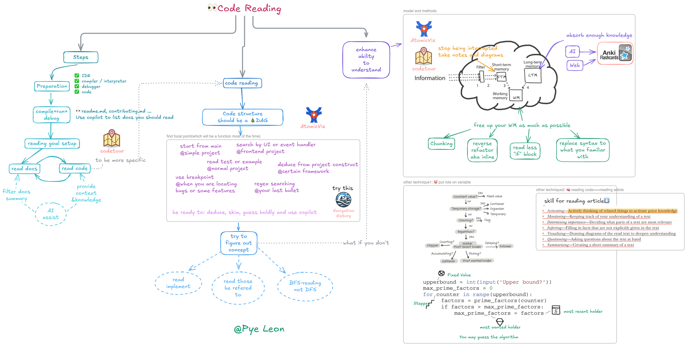

# Unlocking Code Reading: From Novice to Expert

## Code Reading: An Essential Programming Skill

In programmers' daily work, code reading plays an extremely important role. Statistics show that over 50% of programmers' working time is spent reading code. This data clearly indicates that code reading is not just a peripheral part of programming work, but one of the core tasks.

When programmers take over an old system, facing a vast and complex codebase, their primary task is to understand the existing code. Only by comprehending the system's architecture, relationships between modules, and code logic can they extend new features or fix potential bugs. In this process, code is the key to understanding the system's operating mechanism. Without spending time reading code, it's like groping in the dark, making it impossible to determine insertion points for new features or locate and solve program issues.

Code reading is equally indispensable when studying open-source projects. Open-source projects are treasure troves for learning specific knowledge and technology, but this knowledge and technology are embedded in the code. Take some well-known open-source frameworks as examples. Through reading their code, programmers can learn excellent design patterns, efficient algorithm implementations, and good code organization methods. During the reading process, programmers can also encounter different developers' programming styles and approaches, broadening their programming horizons and enhancing their programming abilities. If they skip code reading and rely solely on documentation or others' explanations, it's difficult to deeply understand the essence of open-source projects or fully absorb their knowledge.

## Breaking Myths: Correctly Understanding Code Reading

In the programming field, while code reading is crucial, it's often shrouded in misconceptions. One extreme view is over-mystifying code reading, where some interviewers judge candidates based on whether they've read source code like JVM, as if reading source code is a prerequisite for interviews. However, this view is biased. Code is essentially a compressed encoding of programmers' intentions, like compressed biscuits, containing rich yet highly condensed information. Reading code is actually a complex reasoning process of continuously restoring the author's true intentions. In this process, due to information gaps, developers need to use various raw materials to fill in missing information, including the code itself, related documentation, company business background, historical code versions, external knowledge, and program runtime behavior. This is undoubtedly a quite laborious process. Relying solely on reading code to acquire knowledge is like trying to maintain nutrition by only eating compressed biscuits, making it difficult to meet comprehensive learning needs. If there are books, detailed documentation, or mentor guidance, using these resources comprehensively to acquire knowledge would be much more efficient and effective than reading code alone.

Some people believe that reading code requires meticulously reading every line. In fact, in most practical scenarios, this approach is neither necessary nor realistic. In a vast codebase, the truly frequently used and modified hot code is only a small portion, while most code is rarely involved in daily development. Therefore, developers usually only need to find and read relevant code based on specific tasks and goals. For example, when fixing a bug in a specific feature, they only need to focus on the code module related to that feature, without scanning the entire codebase.

Others think that reading code means following the machine's execution order to understand the code. In reality, except during debugging, this approach is rarely used. Reading code in machine execution order exposes developers to many trivial details in a short time, leading to working memory overload and making it difficult to grasp the overall meaning of the code. In actual code reading, strategies like skimming, scanning, and selective reading are more commonly used. For instance, when encountering familiar function calls or code blocks unrelated to the current reading goal, they can be quickly skipped; for key logical parts, targeted intensive reading is applied.

With the development of artificial intelligence technology, some believe they can completely rely on AI tools, such as directly giving code to GPT, without reading code themselves. However, this idea overlooks some key issues. On one hand, many companies prohibit the use of third-party code assistants due to code confidentiality and security concerns. On the other hand, even without these restrictions, while AI tools can provide certain assistance, such as helping understand code syntax structure and providing possible explanations, they cannot replace human understanding. When using AI tools, if developers themselves lack basic understanding of the code, they don't even know how to accurately write prompts to guide the AI. Only through their own deep reading and thinking of code can they truly master the code's logic, architecture, and the design ideas it contains, thus flexibly applying this knowledge in development to achieve high-quality programming.

## Code Reading Practical Guide

### Environment Setup

Before starting to read code, preparing a suitable environment is crucial. This process mainly includes the following key steps:

**Get the Code**: Clone project code from the code repository to your local development environment using version control systems (like Git). Ensure the obtained code is the latest and complete to avoid subsequent issues due to missing code or version inconsistencies.

**Install Appropriate IDE or Editor**: Choose and install a suitable integrated development environment (IDE) or code editor based on the project's programming language and personal preferences. For example, PyCharm is a powerful IDE for Python projects, offering rich code hints, intelligent completion, and debugging features; while Visual Studio Code is favored by developers for its clean interface and extensive plugin support for lightweight code editing.

**Install Correct Version of Compiler or Interpreter**: Different programming languages require corresponding compilers or interpreters to convert code into executable programs. Be sure to install versions matching the project requirements to ensure code can be correctly compiled and run. For example, C++ projects may need GCC or Clang compilers, while Python projects need corresponding Python interpreter versions.

**Install Debugger and Ensure It's Usable**: Debuggers are important tools for understanding code execution processes and troubleshooting problems. Install a debugger compatible with your IDE or editor, and configure it as necessary to ensure convenient debugging operations while reading code, such as setting breakpoints, single-step execution, and viewing variable values.

Take the Bat Rust project as an example. The specific operations for environment setup are as follows: First, clone the Bat project code to local using Git command: `git clone https://github.com/sharkdp/bat.git`. Then, use Rustup to install Rust language-related tools, such as `rustc` and `cargo`. Next, open an IDE supporting Rust development, like Visual Studio Code, and install the Rust plugin to get code highlighting, syntax checking, and intelligent hints. Finally, ensure the CodeLLDB debugger is correctly installed and configured to prepare for subsequent code debugging.

### Running Code

Getting the code running is a crucial step in understanding code, as observing the actual runtime behavior can provide more information about code logic and functionality than reading static code alone. Different types of programs have different running methods:

**Static Languages**: For static languages like C++ and Java, you need to find the project's target object, usually a main function or entry class. Then use the corresponding compiler to compile the code, generating executable files or bytecode files. After successful compilation, run the generated files to start the program. For example, in a C++ project, you can use the GCC compiler to compile source files into executable files: `g++ main.cpp -o main`, then run `./main` to execute the program.

**Dynamic Languages**: Dynamic languages like Python and JavaScript have relatively simple running methods. Find the way to start the target object, such as the main script file in a Python project, and run it directly using the interpreter. For example, run a Python script `python main.py`.

For open-source projects, you can usually find detailed information about compilation, packaging, and testing steps in the project's `readme.md`, `contributing.md`, and other documentation. Take the Bat project as an example. Execute the `cargo build` command in the project root directory, and Cargo will automatically download project dependencies and compile the code. After successful compilation, run the Bat program using the `cargo run` command. If debugging is needed, configure debugging parameters in the IDE, such as setting breakpoints and selecting debugging targets, then start the program using the debugger. This allows you to deeply understand the execution process and variable changes during code runtime.

### Setting Clear Goals

When facing a vast codebase, setting clear reading goals is key to avoiding getting lost. Code volume is often enormous, and both novices and experienced developers can easily get confused in the sea of code. Therefore, before starting to read code, you must clearly determine your reading goals to stay focused on key code and avoid being distracted by irrelevant details.

Common reading goals include:

**Understanding How a Feature is Implemented**: When you need to implement similar features or optimize existing features in a project, understanding their implementation methods can provide reference and inspiration.

**Understanding Specific Algorithm Implementation**: For algorithm enthusiasts or developers who need to improve algorithm performance, in-depth study of specific algorithm implementation details is essential.

**Locating the Module Where a Bug Occurs**: When troubleshooting program issues, accurately finding the code module where problems might exist is the first step to solving problems.

**Finding Insertion Points for New Features**: When extending a project, you need to determine where in the existing code structure is most suitable for adding new feature code.

To constantly remind yourself of your reading goals, it's recommended to record them in your work log or todo list. For example, write in your work log "Read the code implementing syntax highlighting functionality in the Bat project to understand its implementation principles and key algorithms". This way, you can check it anytime during the reading process to ensure you're always moving towards your goal.

### Studying Documentation

Documentation is an important resource for understanding projects. For mature projects, they usually contain rich documentation, such as project descriptions, technical documentation, and user manuals. Before reading code, prioritizing these documents can help us quickly understand the project's background, goals, and business-specific terms, laying a foundation for subsequent code reading.

By reading project description documents, we can understand the project's origin, purpose, and expected functionality; technical documentation details the project's technical architecture, design patterns, and key technical details, helping us grasp the project's overall technical context; user manuals describe the project's usage methods and operation processes from users' perspectives, which is very helpful for understanding code related to user interaction.

In this era of information explosion, we can also use AI tools to assist in summarizing document content. For example, use the cursor tool to associate with the codebase, then use it to summarize which documents are worth reading and their main content. Specific operations are as follows: Open the cursor tool, associate it with the Bat project's codebase, then enter the command "summarize project documentation". Cursor will analyze the documents and provide key information summaries, such as the project's core functionality, main technology stack, and important configuration parameters. This can greatly improve our document understanding efficiency, quickly obtain key information from documents, and prepare fully for code reading.

### Code Interpretation

After gaining some understanding of the code running environment, goals, and related documentation, you can start formally reading code. The general method for reading code is to first find a focus function as the starting point for reading. A focus function is like a key entrance in a code maze, through which you can gradually understand the code's logical structure and functional implementation. In 99% of cases, a focus function is one with clear functionality and responsibilities.

After finding the focus function, read around it, mainly focusing on what other functions it calls and how it itself is implemented. At the same time, understand which other functions ultimately call this function. Through this approach, you can gradually build a network of calling relationships about the focus function, thus deeply understanding its role and position in the entire code structure.

In this process, we can use code structure to assist understanding. Code structure is essentially a directed acyclic graph (DAG), where each node represents a function, and edges between nodes represent calling relationships between functions. This structure vividly shows the code's execution flow and logical hierarchy, helping us better grasp the code's overall framework. To more intuitively show code structure, we can use some tools, such as the AtomicViz plugin. Take the Bat project as an example. After installing and enabling the AtomicViz plugin, it will automatically analyze project code and generate a visual code structure chart. In this chart, we can clearly see the calling relationships between various functions and the dependency relationships between different modules. By viewing this chart, we can quickly find focus functions and understand their position and upstream/downstream relationships in the entire code structure, thus reading code more purposefully.

There are many ways to find focus functions, specifically as follows:

**For Simple Programs**: If the program structure is relatively simple, usually the `main` function is the focus function, as it's the program's entry point, from which you can gradually understand the program's overall execution flow.

**Programs with Frontend**: If the program includes frontend parts, you can start from UI elements. For example, search for related JavaScript code based on HTML elements' `id` or `class name` to find focus functions related to user interface interaction.

**Programs Handling User Input**: For programs that can respond to keyboard, mouse, and other user input events, you can start from event handlers. Find functions handling input signals, which are often key focus functions through which you can understand how the program responds to user operations.

**Find from Tests or Examples**: Many projects include test cases or example code, which usually demonstrate the project's basic functionality and usage methods. You can find some key function calls from tests or examples, then determine focus functions.

**Framework-based Projects**: If the project uses specific frameworks like Spring or Django, you can speculate focus function locations based on the framework's code structure and conventions. For example, in the Spring framework, methods in controller classes are usually key functions handling business logic and can be used as focus functions for reading.

**Using Breakpoint Debugging**: When you need to find code related to specific functionality, you can set breakpoints in the code, then start the functionality and observe which functions are hit when the program executes, these functions are focus functions related to that functionality.

**Using Search Tools**: If the above methods don't apply, you can use search tools like `grep` or `ripgrep` to find possible focus functions through keyword search. For example, search for function names, variable names, or business logic keywords related to specific functionality to find relevant code snippets.

### Understanding Code

After determining the focus function, understanding its implementation is one of the core tasks of code reading. Usually, we use a breadth-first traversal approach to understand the focus function's implementation. This approach is like exploring a map, starting from a center point and gradually exploring surrounding areas, first understanding the general situation of each area rather than immediately delving into details of a specific area.

Specifically, when analyzing the focus function, we mainly focus on what sub-functions it calls, and for the specific implementation of sub-functions, unless particularly interested or necessary, we generally don't need to immediately look into them. This is the so-called "if not necessary, don't look at implementation" principle, which helps us avoid getting stuck in too many details when reading code, thus grasping the overall logic faster. For example, in the Bat project, if the focus function is one responsible for handling file reading, it might call some sub-functions for opening files, reading file contents, and closing files. We first focus on these sub-functions' functionality and calling order to understand the overall file reading process, while temporarily not deeply studying specific implementation details of each sub-function, such as specific file reading algorithms and error handling mechanisms.

However, for some functions with unclear or ambiguous names, it's difficult to guess their functionality just from the function name, so we need to look at the function's specific implementation to accurately understand its role. This is also why some projects with poor code quality make reading difficult, as their function naming and code structure might not be clear, increasing reading costs.

In contrast to breadth-first traversal is depth-first traversal, where you look into the specific implementation of each method you encounter. Although this approach matches the machine's execution order, when understanding large code segments, it easily leads to working memory overload. Because when looking into each sub-function's implementation, it involves a large amount of detail information, which takes up a lot of working memory space, making it difficult to remember other related information simultaneously, thus affecting understanding of the code as a whole. Unless you're doing debugging work and need to deeply understand specific execution details, depth-first traversal is rarely used when reading code. For example, when reading the Bat project's code, if using depth-first traversal, when encountering a complex function call chain, you might get lost in the process of looking into each sub-function's implementation, making it difficult to grasp the overall file processing functionality implementation logic. While breadth-first traversal lets us first understand the file processing process from a macro perspective, then deeply study specific sub-function implementations as needed, which is more helpful for establishing comprehensive understanding of the code.

## Strategies for Improving Code Understanding

### Knowledge Accumulation and Long-term Memory

Improving code understanding is closely related to memory. In some theories, understanding and memory are considered two sides of the same coin, enhancing memory helps improve understanding. In the memory system, long-term memory, short-term memory, and working memory play different roles. Long-term memory is like a hard drive, with large storage capacity and persistent information retention, but slow write speed; short-term memory is similar to RAM, with fast read/write speed but limited capacity and short information retention time; working memory is like CPU registers, fastest in speed but smallest in capacity, playing a key information processing role in the understanding process.

When reading code, if long-term memory lacks relevant knowledge, understanding becomes difficult. For example, when encountering code using specific design patterns or complex algorithms, if developers lack understanding of these design patterns and algorithms, it's difficult to understand the code's intent and implementation logic. Therefore, storing rich knowledge in long-term memory is key to improving code understanding. This knowledge covers syntax rules, common design patterns, project business background, key business concepts, and classic algorithms and data structures.

To accumulate this knowledge, you can use AI and search engines. By entering relevant keywords in search engines, such as "common design patterns" and "key concepts in a business domain", you can get a lot of materials. Use AI tools, such as letting AI organize and summarize the searched knowledge, generating easy-to-understand content. Make these knowledge into flashcards and input them into anki software for repeated memory and review. For example, for a design pattern, you can make flashcards with its definition, characteristics, usage scenarios, and other information, set reasonable review intervals in anki, and through repeated learning, let this knowledge gradually penetrate into long-term memory. Although this process requires persistent effort, it's an effective way to improve code understanding.

### Context Retention and Short-term Memory

Lack of context information in short-term memory also negatively affects code understanding. When reading code, as reading deepens, we gradually accumulate context information about code organization structure, function calling relationships, special implementation details, etc., which is crucial for understanding code. However, in actual development, we're often interrupted by various things, such as meetings and colleagues asking questions, which causes context information in short-term memory to gradually blur. When we return to code reading, we need to spend a lot of energy restarting memory, which undoubtedly increases the difficulty of understanding code.

To let context information in short-term memory last as long as possible, we should try to avoid interruptions. When reading code, you can choose a relatively quiet, less disturbed environment to concentrate on reading. At the same time, we can retain important context information through note-taking and drawing. For example, use the codetour plugin to add comments and explanations to key code snippets during the reading process, and connect these comments to form a visual code thinking record. Use atomicViz tool to view code structure, present code organization structure and calling relationships in chart form, and record important conclusions in notes. This way, when our short-term memory becomes fuzzy, we can quickly reload context information by viewing notes and charts, reducing pressure on short-term memory, thus understanding code more smoothly.

### Reducing Working Memory Usage

Working memory capacity is inherently limited and difficult to expand through practice. When working memory is filled with trivial details, the understanding process is hindered, making it difficult to grasp the overall logic of the code. For example, novices often read code line by line carefully, focusing on every syntax detail and implementation detail, which quickly fills working memory, making it impossible to effectively process other important information. While experienced developers often use skimming and scanning methods, focusing attention on key abstract conclusions, avoiding storing too many trivial details in working memory, which is the so-called "chunking" phenomenon.

To reduce working memory usage, we can take the following specific operation methods:

**Replace Unfamiliar Syntax Details**: When encountering unfamiliar special syntax details, you can first replace them with familiar writing methods. For example, in Python, for some complex list comprehensions, if they're difficult to understand, you can convert them to ordinary for loops, which can reduce understanding difficulty and working memory usage.

**Skip Code Blocks with Comments**: If code has detailed comments describing a code block's function, during initial reading, you can directly skip that code block, first grasping the overall logic, avoiding spending too much energy on details. For example, for code implementing complex algorithms, if comments clearly explain the algorithm's function and implementation ideas, you can first not deeply study the specific code, but continue reading other parts.

**Ignore Error Handling or Special Case Branches**: When reading code, you can temporarily ignore code branches handling errors or special cases. Because these branch codes usually increase code complexity, during initial code understanding, focus on main business logic, and after having some grasp of the whole, come back to study these branches. For example, in a file reading function, there might be a lot of code handling cases like file not existing and insufficient permissions. During initial reading, you can first focus on normal file reading process, ignoring these error handling branches.

**Reverse Refactor Complex Code Organization**: When code organization structure is difficult to read, such as one function implementation being split into a dozen files, you can do reverse refactoring. For example, directly replace function calls with function internal code, organizing all implementation code into one function, which can simplify code structure and facilitate reading. However, note that this refactoring is only for improving reading efficiency and generally won't be submitted to the codebase, as it might destroy the original code structure and modular design.

Take a practical case as an example. When reading a complex web application's code, there's a function handling user requests, which calls multiple other functions and modules, and contains a lot of error handling and logging code. During reading, you can first ignore error handling and logging parts, focusing on core business logic, that is, how to receive user requests, process request data, and return response results. For called other functions, you can first understand their function overview without looking into specific implementation. Through this method, you can quickly grasp the code's main process, reduce working memory usage, and improve reading efficiency. After having clear understanding of main logic, gradually study other detail parts, such as error handling mechanisms and logging methods, which can help you understand code more comprehensively and deeply.

## Summary and Review

As one of programmers' core skills, code reading plays a pivotal role in software development. Through a series of key steps including environment preparation, code running, goal setting, document reading, and code reading, we can gradually understand code's logic, functionality, and architecture. When reading code, finding focus functions based on goals and using breadth-first traversal for understanding can help us efficiently grasp code's core content and avoid getting stuck in unnecessary details.

Improving code understanding is a long-term and continuous process, requiring us to work from multiple aspects including increasing long-term memory knowledge reserve, retaining short-term memory context information, and reducing working memory unnecessary usage. Through continuous learning and knowledge accumulation, using effective memory methods and tools, and adopting reasonable reading strategies and techniques, we can gradually improve our code reading ability and better cope with complex programming tasks and challenges.

Code reading is a process of continuous practice and exploration. I hope everyone can apply the above methods and techniques to actual work, through continuous code reading and analysis, accumulate experience, and improve ability. When encountering problems, actively seek solutions, continuously summarize and reflect, gradually form your own code reading style and method system. I believe that with continuous effort, every developer can become a code reading expert and achieve greater progress on the programming path.
